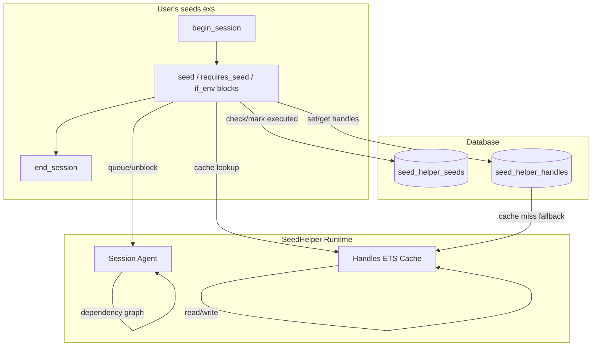

# Project Architecture

## Overview

SeedHelper is an Elixir library that provides **idempotent, dependency-aware database seeding** for Ecto applications. It wraps seed blocks in macros that track execution in the database, resolve inter-seed dependencies at runtime via an Agent process, and support environment-conditional execution. The library is designed to be called from `priv/repo/seeds.exs` files within a session lifecycle.

## System Diagram

## Core Components

| Component | Purpose |
|-----------|---------|
| `SeedHelper` | Public macro API — `seed`, `requires_seed`, `if_env` |
| `SeedHelper.Session` | Agent-based session lifecycle and dependency resolution |
| `SeedHelper.Seeds` | DB-backed seed execution tracking (idempotency) |
| `SeedHelper.Handles` | Named value store with ETS cache for cross-seed references |
| `SeedHelper.Migration` | Ecto migration creating backing tables |
| `SeedHelper.Schema.*` | Ecto schemas for `seed_helper_seeds` and `seed_helper_handles` |

## Data Flow

1. `begin_session/0` starts an Agent process (dependency graph) and an ETS table (handle cache)
2. `seed/3` checks the DB for prior execution; if new, runs the block, marks it executed, and triggers any unblocked dependents
3. `requires_seed/2` checks prerequisites — if all met, runs immediately; otherwise queues in the Agent until dependencies resolve
4. `end_session/0` stops the Agent and reports any unresolved dependencies as errors

## Key Design Decisions

- **Agent for dependency graph**: Lightweight in-process state fits the single-run, sequential nature of seed files — no GenServer or supervision needed
- **ETS for handle cache**: Handles are read-heavy after initial write; ETS provides fast concurrent reads without round-tripping to the DB
- **DB-backed idempotency**: Seed execution state persists across runs via `seed_helper_seeds` table, ensuring seeds are never re-applied
- **Macro-based API**: Macros (`seed`, `requires_seed`, `if_env`) provide ergonomic DSL syntax directly in seed files

## Technology Stack

| Layer | Technology |
|-------|-----------|
| Language | Elixir ~> 1.10 |
| Database | Ecto SQL ~> 3.6 (any Ecto-supported DB) |
| Caching | ETS (in-process) |
| State | Agent (in-process) |
| ID Generation | elixir_uuid |
| Package | Hex (published as `:seed_helper`) |
